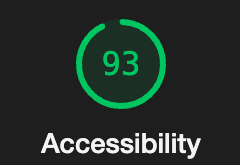

# Can of Books Front-End

**Author**: Rhett Chase || Kaitlin Davis

**Version**: 1.0.0

## Overview

Can of Books is a user-friendly application designed to simplify the process of finding books. Whether you're a book enthusiast, a student, or just someone looking for a good read, Can of Books helps you locate books with various titles with ease. The user can filter based on the book availability to see which books they can access.

[Front-end GitHub Repo](https://github.com/KaitlinDa/can-of-books-frontend)
[Back-end GitHub Repo](https://github.com/rhettchase/code-301-can-of-books-backend/tree/main)
[Deployed Site](https://can-of-books-rckd.netlify.app/)

## Getting Started

In order to get started, you make a repo on GitHub and clone the repository to your local machine. There are two repositories for this app (front-end and back-end). Then, install the dependencies you need. Set up any environmental variables. Start the sever.

### Install Dependencies

- Axios
- Bootstrap
- react-router-dom
- react-dom

## Architecture

- JavaScript
- React
- CSS

## Change Log

12-11-2023 6:30pm - Implemented a fully functional front-end running on `local server` using React Carousel, which displays books based on availability status that the user selects from drop-down. Utilized `BrowserRouter` to store the current location in the browser's address bar using clean URLs and navigates using the browser's built-in history stack.

## Estimates

### Set Up, Storage, and Book Component

- Estimate of time needed to complete: 2.5 hours
- Start time: 4:00pm
- Finish time: 6:30pm
- Actual time needed to complete: 2.5 hours

## Credit and Collaborations

- Chat GPT
- React Dev Docs

## Lighthouse Score

