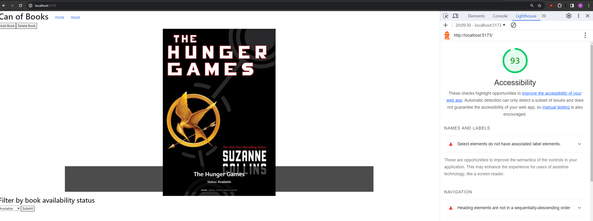

# Can of Books Front-End

**Author**: Rhett Chase || Kaitlin Davis

**Version**: 2.0.0

## Overview

Can of Books is a user-friendly application designed to simplify the process of finding books. Whether you're a book enthusiast, a student, or just someone looking for a good read, Can of Books helps you locate books with various titles with ease. The user can filter based on the book availability to see which books they can access. The user also has the ability to add or remove books from the collecction.

- [Front-end GitHub Repo](https://github.com/KaitlinDa/can-of-books-frontend)
- [Back-end GitHub Repo](https://github.com/rhettchase/code-301-can-of-books-backend/tree/main)
- [Deployed Site](https://can-of-books-rckd.netlify.app/)

## Getting Started

In order to get started, you make a repo on GitHub and clone the repository to your local machine. There are two repositories for this app (front-end and back-end). Then, install the dependencies you need. Set up any environmental variables on Nelify. The custom server is hosted on `render` and does not require additional setup.

### Install Dependencies

- Axios
- Bootstrap
- react-router-dom
- react-dom
- Create an `.env` file: assign `VITE_SERVER_URL` to your localhost. Make sure this file is in your `.gitignore`.

## Architecture

- JavaScript
- React
- CSS

## Change Log

- 12-11-2023 6:30pm - Implemented a fully functional front-end running on local server using React Carousel, which displays books based on availability status that the user selects from drop-down. Utilized BrowserRouter to store the current location in the browser's address bar using clean URLs and navigates using the browser's built-in history stack.
- 12-12-2023 8:00pm - Implemented an add and delete book functionality for the user to have the ability to add a new book to the collection or delete a book form the collection using `/POST` and `/DELETE`. Developed a modal for a clean form interface to allow focus of the user.
- 12-13-2023 6:50 pm - Added a form in the front end to let the user edit an existing book's details in a modal. When the form is submitted, send the new data to the server, and update the page according to the response.

## Estimates

### Lab-11: Set Up, Storage, and Book Component

- Estimate of time needed to complete: 2.5 hours
- Start time: 4:00pm
- Finish time: 6:30pm
- Actual time needed to complete: 2.5 hours

### Lab 12: Create Book

- Estimate of time needed to complete: 2 hours
- Start time: 2:30pm
- Finish time: 5:00pm
- Actual time needed to complete: 1.5 hours

### Lab 12: Delete Book

- Estimate of time needed to complete: 2 hours
- Start time: 5:00pm
- Finish time: 6:30pm
- Actual time needed to complete: 1.5 hours

## Credit and Collaborations

- Chat GPT
- React Dev Docs

## Lighthouse Score

